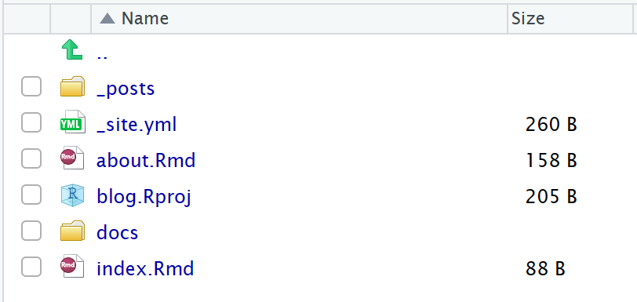
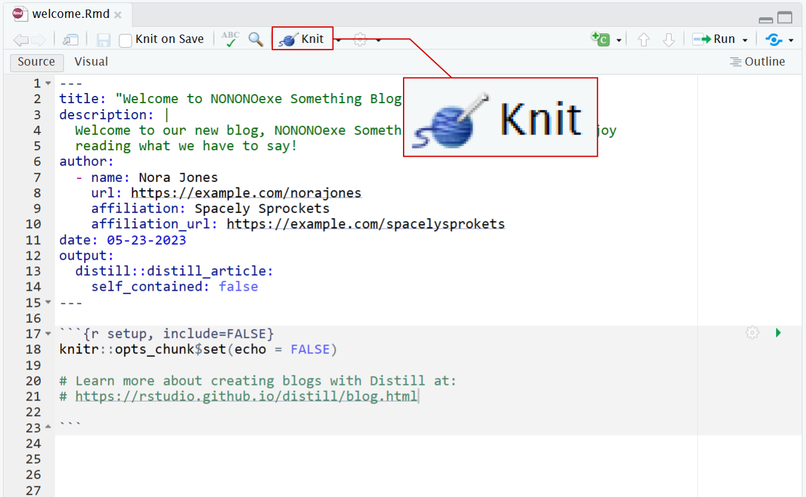
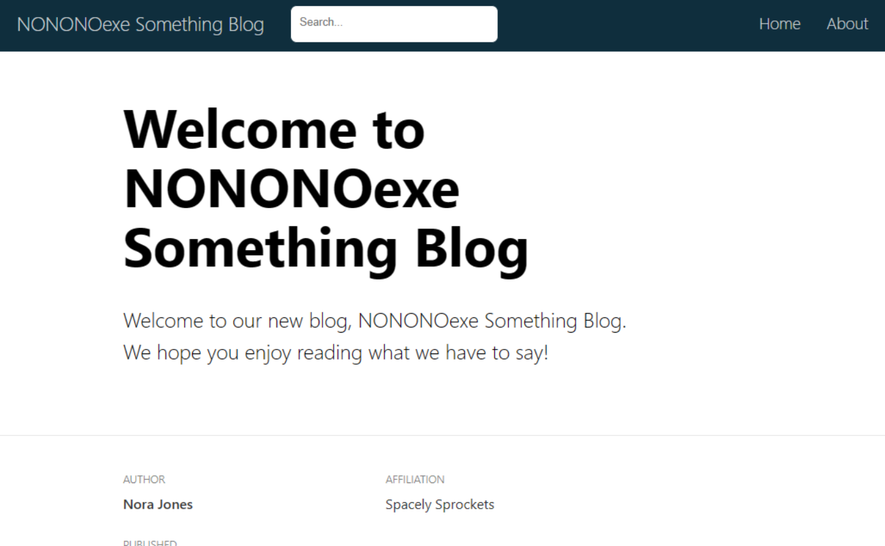
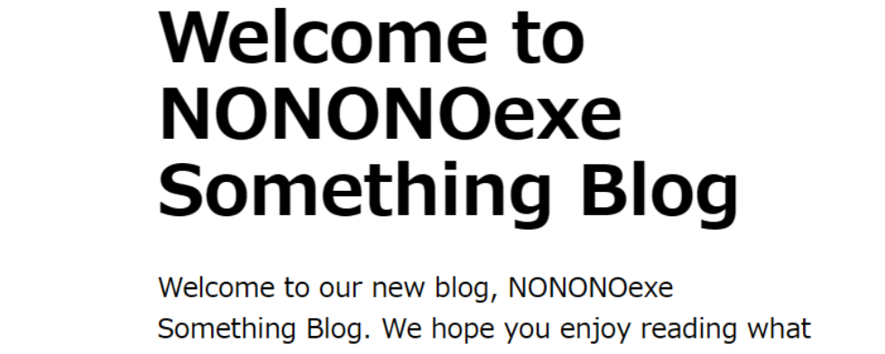
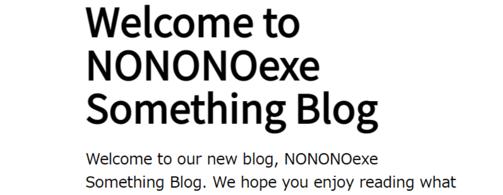

```{r setup, include=FALSE}
# knitr::opts_chunk$set(echo = FALSE)
```

## 1. はじめに

自分のブログを作成しようと思って、持っている技術で作る方法がないかと模索していたところ、R Packageの`distill`で作れることを知りました。この記事では、このブログを作成するときに学んだ方法やそれに伴って知った情報を紹介します。またこれから新しい技術や方法を知って、ブログを大きく変更することがあると思いますが、そのときには同時にこの記事も更新したいと思います。

## 2. ブログを立てる

### テンプレートの作成

`{distill}`では非常に簡単にブログが作成できます。`distill::create_blog()`を実行するだけです。あとは対話的にディレクトリとブログ名を決定して、一連のテンプレートが作成できます。

本ブログはGitHub Pagesで公開したかったため、以下の引数によりオプションを指定して、作成しました。

```{r create_blog, include=TRUE, eval=FALSE}
# ブログの作成
distill::create_blog(
  dir      = "blog",                     # ブログを作成するディレクトリ
  title    = "NONONOexe Something Blog", # ブログのタイトル
  gh_pages = TRUE                        # GitHub Pagesにより公開するかどうか
)
```

実行すると次のようにテンプレートが生成されます。また、最初の記事として、`welcome.Rmd`が作成されます。これを編集して、最初の記事を書くことができます。

{width=75%}


### 記事の作成

新たに記事を作成するのも非常に簡単です。次のように`distill::create_post()`でベースを作成できます。なお、引数の`title`から日本語のタイトルは付けられないため、注意が必要です。付ける場合はあとから編集で付けます。

```{r create_post, include=TRUE, eval=FALSE}
# 記事の作成
distill::create_post(
  title       = "how-to-create-blog", # 記事のタイトル
  author      = "Keisuke ANDO",       # 記事の著者
  date_prefix = NULL                  # 日付をファイル名に付けない
)
```

記事はRMarkdownで作成されるので、HTMLで確認する場合はRStudioのKnitボタンから、Knitしましょう。

{width=90%}

{width=90%}


## 3. ブログをカスタマイズする

### CSSによるカスタマイズ

記事`{distill}`で作成したページは通常のHTMLでのウェブサイト作成のようにCSSによるカスタマイズが可能です。次の`distill::create_theme()`を実行することで、CSSのファイルが作成されます。

```{r create_theme, include=TRUE, eval=FALSE}
# CSSによりテーマをカスタマイズ
distill::create_theme()
## v Created CSS file at theme.css 
## o TODO: Customize it to suit your needs 
## o TODO: Add 'theme: theme.css' to your site or article YAML
```

メッセージでTODOとして出力されたとおり、CSSのカスタマイズとサイトの構成を管理するYAMLファイルへの追記します。簡単な例としてヘッダのフォントを[Noto Sans JP(Google Fonts)](https://fonts.google.com/specimen/Noto+Sans+JP)に変更する場合は`theme.css`を次のように変更します。

```{css example_custom_styles, eval=FALSE}
/* Optional: embed custom fonts here with `@import`          */
/* This must remain at the top of this file.                 */
@import url('https://fonts.googleapis.com/css2?family=Noto+Sans+JP&display=swap');


html {
  /*-- Main font sizes --*/
  --title-size:      50px;
  --body-size:       1.06rem;
  --code-size:       14px;
  --aside-size:      12px;
  --fig-cap-size:    13px;
  /*-- Main font colors --*/
  --title-color:     #000000;
  --header-color:    rgba(0, 0, 0, 0.8);
  --body-color:      rgba(0, 0, 0, 0.8);
  --aside-color:     rgba(0, 0, 0, 0.6);
  --fig-cap-color:   rgba(0, 0, 0, 0.6);
  /*-- Specify custom fonts ~~~ must be imported above   --*/
  --heading-font:    'Noto Sans JP', sans-serif; /* edited */
  --mono-font:       monospace;
  --body-font:       sans-serif;
  --navbar-font:     sans-serif;  /* websites + blogs only */
}
```

また、CSSを反映するために`_site.yml`にも以下の部分を追記します。

```{yml site_yaml, eval=FALSE}
name: "blog"
title: "NONONOexe Something Blog"
description: |
  NONONOexe Something Blog
output_dir: "docs"
theme: theme.css  # theme.cssを使用
navbar:
  right:
    - text: "Home"
      href: index.html
    - text: "About"
      href: about.html
output: distill::distill_article
```

この状態で、ページをKnitするとフォントが次のように変更されたHTMLが生成されます。

{width=90%}

{width=90%}


## 4. まとめ

「Rでブログを作成する」というちょっと変わったアプローチでしたが、想像以上に簡単に作成できることがわかりました。`{distill}`の基本はRMarkdownのため、他の関連パッケージと組み合わせることでまだまだいろいろなことができそうです。[The Distillery](https://distillery.rbind.io/)というサイトでは、`{distill}`を使ったさまざまなサイトを紹介しています。これも参考にこのブログもまた改善を加えていけたらと思います。


<!-- ### サイト構成の変更 -->

<!-- ### `{postcards}`によるカスタマイズ -->

<!-- https://distillery.rbind.io/ -->
