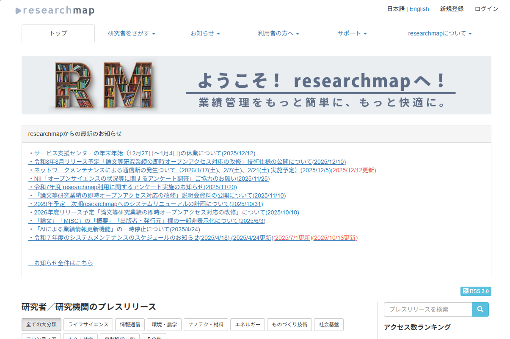
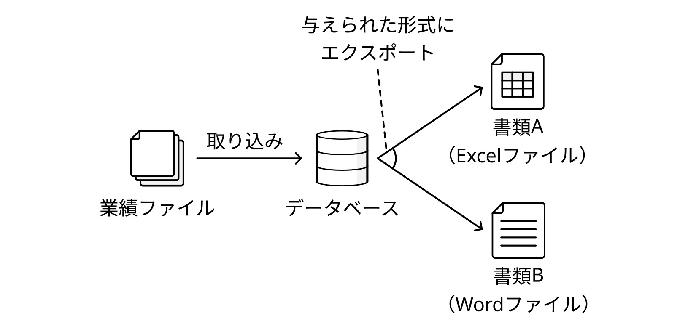
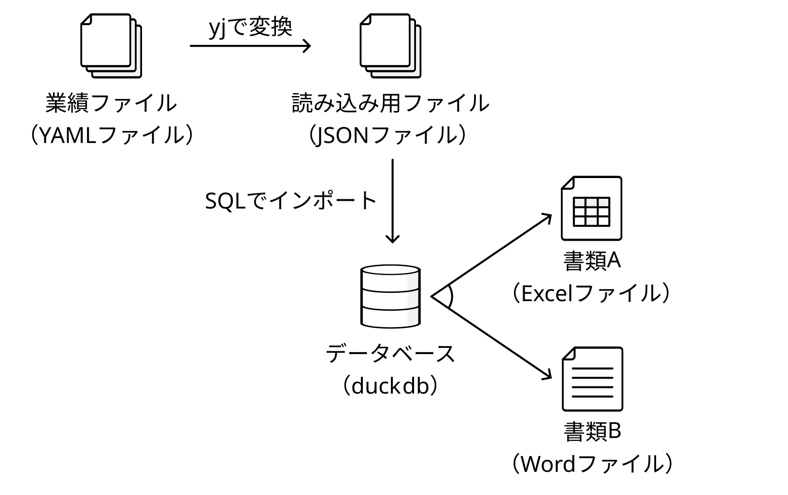
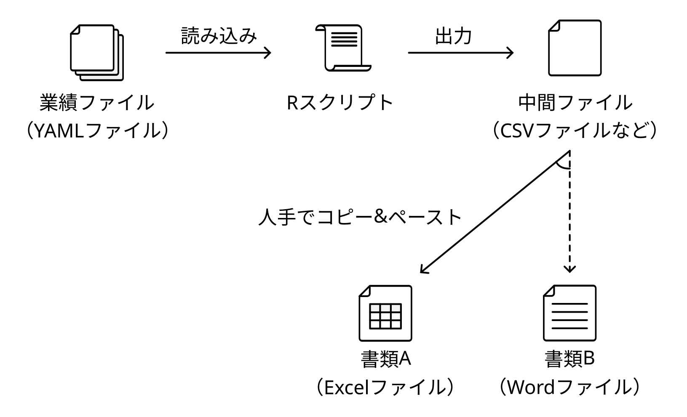
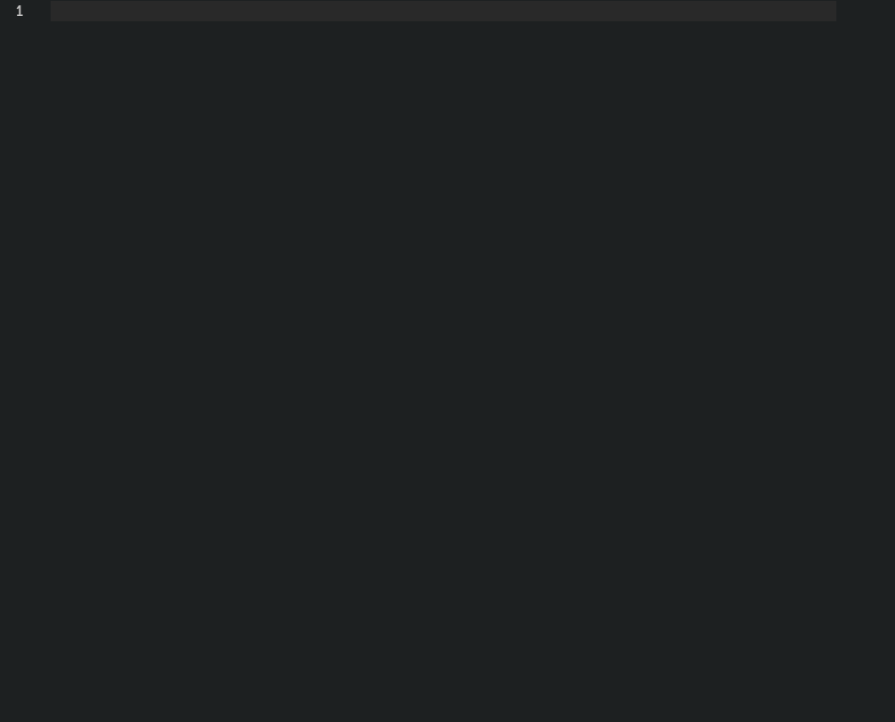
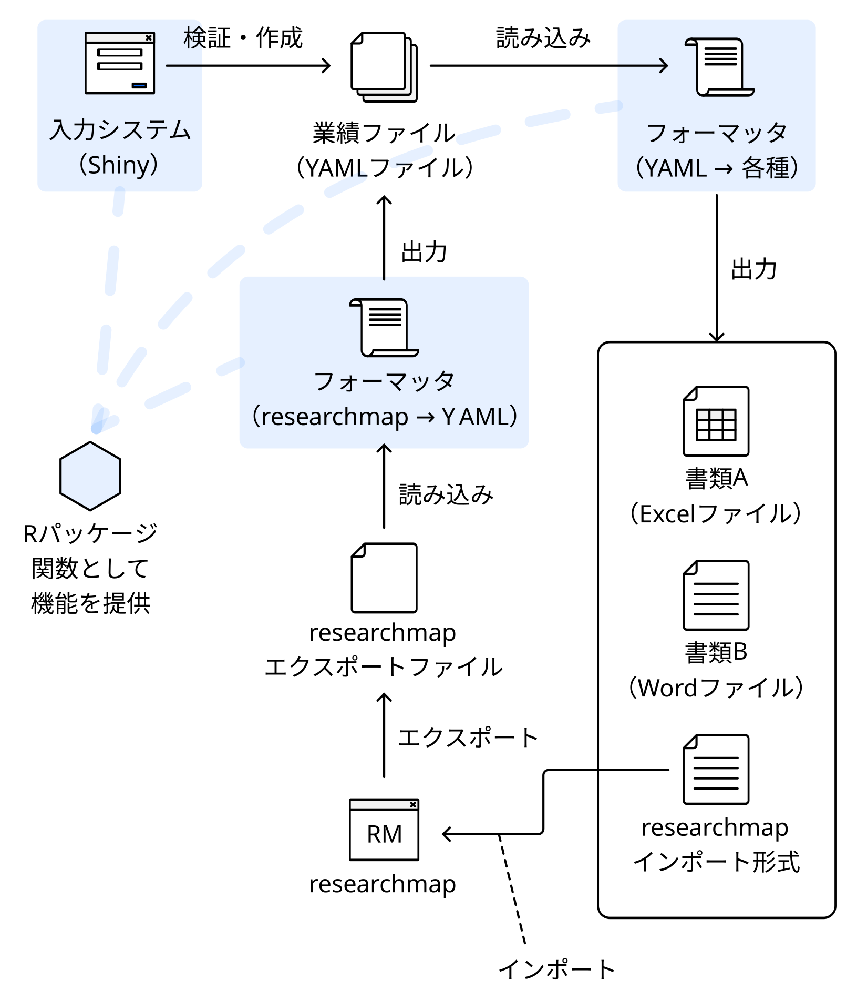

::: {.callout-note icon=false appearance="simple"}
この記事は[R言語 Advent Calendar 2025](https://qiita.com/advent-calendar/2025/rlang)の20日目の記事です。
:::

## 1. はじめに

私はいま博士後期課程に在籍していて、就職活動をしています。
就職（研究職・助教）に関して、よいお話があればご紹介ください。

それはさておき、こうした学位申請や就職活動の中、業績の一覧を求められる機会が増えてきました。
今回はこの書類作成を半自動化しようというお話です。

ここでいう、「業績」とは、これまでに発表した論文や受賞した賞などのことです。
このような書類作成やこれに向けた自分の業績を記録、整理することを「業績管理」と呼んでいます。
業績管理が身近にないという方は経歴書自動作成と読み替えてもらうと理解しやすいかもしれません。

## 2. 最初のアイデア

研究業績管理のためのサービスにはすでに[researchmap](https://researchmap.jp/)があります。researchmapは研究者が自身のアカウントに経歴、論文、所属等の情報を記録でき、共有できるサービスです。



しかし、ここまで活動してきた中でresearchmapのURLを参考情報として求められる場合はあっても、この情報のみを提出するということはありませんでした。また、例えば各業績に対する寄与度など、researchmapにはない項目が求められることもありました。

これに対して、「researchmapとは別に、業績を手元でデータベース化してしまえばよいのではないか？」と考えました。私が最初に考えたアイデアは次のようなものです。



業績の情報をresearchmapのように書き込んだファイルを作成して、それをデータベースに読み込ませます。それから、データベースに必要な出力形式をSQLの形で与え、各ファイルにエクスポートするというものです。

入力のファイルの部分はインターフェースに不都合がなければ、通常のデータベースクライアントソフト（DBeaver等）でもよいだろうと思います。ただ、Git管理できた方が嬉しかったので、ファイルにすることにしました。

## 3. 実装と考え直し

実装にあたり、まずデータベースマネージャから考えました。シンプルなものですから「コンパクトで可搬性にも優れるSQLiteでよいだろう」と考えていました。
一方、「SQLiteではファイルとのやりとりが心もとないかな？」と思い、ファイルから直接読み込み可能なデータベースマネージャを調べてみました。

そうしたところ、duckdbが候補に挙がってきました。
duckdbは以前にも触れたことがありましたが、比較的新しいデータベースマネージャで知らないことも多いため、勉強も兼ねて「これで行こう」となりました。
そこで、次のようなシステムを考えました。



duckdbでは、JSONファイルをインポートできます。
JSONファイルはCSVなどと比較して、階層的に記述でき、拡張性もあります。
一方、JSONはコメントがないことや構造化のための記述を含むため、人間が書く／読むことを思うと、扱いにくいです。
そこで、人間（ユーザー）の入力はYAMLファイルにしました。
YAMLファイルからJSONへは[yjコマンド](https://github.com/sclevine/yj)やプログラムによる変換が可能です。

このあと、実際にyjコマンドで変換したり、やっぱり外部のコマンドへの依存が気になり、Pythonで変換プログラムを作成したりしていました。しかし、そうこうしているうちに「取り込み用のプログラム書くなら、そもそもYAMLファイル群をデータベースとしてプログラムで形式変換したら、十分では？」となってきました。

## 4. Rスクリプトによる業績データ管理

紆余曲折ありましたが、最終的に作成したシステムは次のようなものです。



作業手順は以下のとおりです．

1. まず業績ファイルをYAML形式で入力します。
2. このYAMLファイルをRスクリプトで読み込みます。
3. 目的のファイルにコピー&ペーストすれば済むようなテキストデータとして出力します。

ExcelやWordへ直接出力することもできますが、やや複雑になるため、このようにしました。
ここまでに考えていたものと比較して、シンプルになりました。

YAMLの入力をしやすいように、テンプレートを作成して、そのテンプレートをVSCodeのスニペットに対応させました。
新規業績を登録する際は、入力、タブ、入力、タブ…と移動しながら入力できます。



このスニペットを使用して、1ファイル1業績として、次のようなデータを業績ごとに作成しました。
中身としては、タイトル、著者、掲載情報などを記入できるようにしています。
YAMLですから、後から項目を追加したくなった場合にも柔軟に対応できます。

```{.yaml filename="2025-09-TrafficSafetyMultiAgentSimulation.yaml"}
meta:
  schema: publication
title: 交通安全を目指す研究におけるマルチエージェントシミュレーションの利用の検討
publication_type: domestic_conference
peer_reviewed: no
authors:
- name: 安藤 圭祐
  type: contributor
- name: 内種 岳詞
  type: supervisor
- name: 向 直人
  type: supervisor
- name: 岩田 員典
  type: supervisor
- name: 伊藤 暢浩
  type: supervisor
venue: 電気・電子・情報関係学会東海支部連合大会
volume: ~
issue: ~
pages: 1
publication_date: 2025-09
doi: ~
url: ~
acceptance_rate: ~
```

それから、これらのデータを次のようなプログラムで読み込んで、形式変換しました。
基本的には、各YAMLの属性を入力として、必要な出力形式を作成する関数を項目ごとに作っておき、すべてのデータを`{purrr}`と`{yaml}`で読み込んだら、その関数に通すというものになっています。

```{.r filename="export-publication.R"}
#' CSV形式にで論文情報をエクスポートするためのスクリプト

# 寄与度の算出
calc_my_contribution <- function(authors) {
  my_idx  <- which(purrr::map_chr(authors, "name") %in% my_name)
  my_type <- authors[[my_idx]]$type

  n_contrib <- sum(purrr::map_chr(authors, "type") == "contributor")
  n_super   <- sum(purrr::map_chr(authors, "type") == "supervisor")

  ifelse(my_type == "contributor", 80 / n_contrib, 20 / n_super)
}

# タイトルの形式をタイトル + DOI or URLにフォーマット
format_title <- function(title, doi, url) {
  id <- ifelse(!is.null(doi), doi, ifelse(!is.null(url), url, NA_character_))
  paste0(title, ifelse(!is.na(id), paste0("，", id), ""))
}

# 掲載情報の形式を巻・号・ページにフォーマット
format_publication_info <- function(venue, volume, issue, pages) {
  volume_str   <- ifelse(!is.null(volume), paste0("vol. ", volume), "")
  issue_str    <- ifelse(!is.null(issue), paste0("no. ", issue), "")
  pages_prefix <- ifelse(grepl("-", pages), "pp. ", "p. ")
  pages_str    <- paste0(pages_prefix, pages)

  parts <- c(venue, volume_str, issue_str, pages_str)
  parts <- parts[parts != ""]

  paste0(parts, collapse = "，")
}

# 日付の形式をyyyy年M月にフォーマット
format_publication_date <- function(date_str) {
  date <- lubridate::ym(date_str)
  paste0(lubridate::year(date), "年", lubridate::month(date), "月")
}

# 自分の名前（寄与度の算出用）
my_name <- c("安藤 圭祐", "Keisuke ANDO")

# yaml::read_yamlで全ファイルを読み出し
files <- list.files("data", pattern = "\\.ya?ml$", full.names = TRUE)
raw <- purrr::map(files, yaml::read_yaml)

# Tibble形式に変換
publications <- dplyr::tibble(
  title            = purrr::map_chr(raw, "title"),
  authors_list     = purrr::map(raw, "authors"),
  doi              = purrr::map(raw, "doi"),
  url              = purrr::map(raw, "url"),
  venue            = purrr::map_chr(raw, "venue"),
  volume           = purrr::map(raw, "volume"),
  issue            = purrr::map(raw, "issue"),
  pages            = purrr::map(raw, "pages"),
  publication_date = purrr::map_chr(raw, "publication_date"),
  publication_type = purrr::map_chr(raw, "publication_type"),
)

# 各属性をフォーマット、寄与度を算出
publications <- publications |>
  dplyr::filter(publication_type %in% c("domestic_conference",
                                        "poster",
                                        "technical_report")) |>
  dplyr::rowwise() |>
  dplyr::mutate(
    authors_str          = paste(purrr::map_chr(authors_list, "name"), collapse = "，"),
    title_str            = format_title(title, doi, url),
    my_contribution_str  = paste0(calc_my_contribution(authors_list), "%"),
    publication_info_str = format_publication_info(venue, volume, issue, pages),
    publication_date_str = format_publication_date(publication_date)
  ) |>
  dplyr::ungroup()

# 必要な項目のみを抽出して、CSVに出力
csv_data <- publications |>
  dplyr::transmute(
    `著者`          = authors_str,
    `タイトル・DOI` = title_str,
    `掲載情報`      = publication_info_str,
    `発行年月`      = publication_date_str,
    `寄与率`        = my_contribution_str,
  )
readr::write_csv(csv_data, "output/publications.csv")
```

## 5. さらなる発展

このシステムには、次のような課題があります。

1. researchmapのデータを利用する際には、現状手入力しなければならないこと
2. データがバリデーションされないこと（スニペットである程度入力規則は制御している）
3. フォーマッタとなるRスクリプトを書くのが慣れていないと大変であること（誰でもできるわけではない）

これを解決するシステムとして次のようなものを考えました。



とはいえ、今回の目的は書類作成です。
システム屋の性に流されて、作り込んでいくのは危険であると判断しました。
コーディングしていると、パッケージ化したくなる気持ちをぐっと抑えました。

今後、業績を整理しなければならないタイミングは繰り返し出てきます。
そこで気長にブラッシュアップしていこうと思っています。

今回、このような仕組みを作りましたが、そもそもすでに類似のシステムや各人でオリジナルな仕組みを持っている方もいるかもしれません。
そういった情報がありましたら、参考までにぜひ教えてもらえると嬉しいです。
